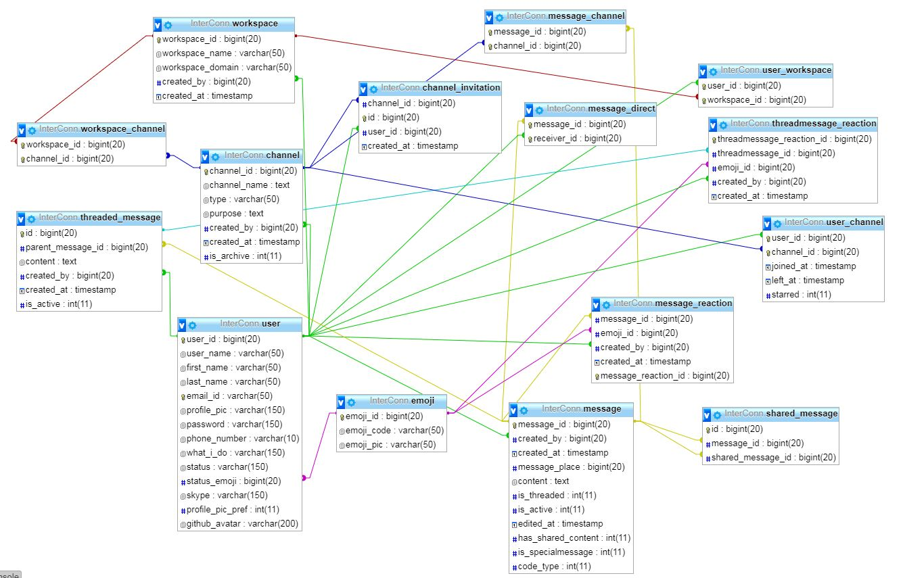

# WebProgramming-CS518 ( Interconn - A Slack like platform for Interprofessional Collaboration )

### Intro to the features available 

InterConn is a web based platform, works like the very popularly used collaborative tool called Slack. This tool allows the user to post messages in channels, directly to another user, makes it possible for the user to like and dislike the messages posted, allows the user to search for other user profiles. 

Along with these features, live collaboration satisfies an effective use case for the users to be able to collaborate live by looking at, editing each other changes at real time like Google Docs. Third party APIs like Gravatar for standardize avatars across the platforms, GitHub API for Authentication through GitHub, No Captcha ReCaptcha for solving bot issues and finally Firebase to get the Websockets implemented toward accomplishing live collaboration were used. 

LAMP is technical stack used for implementation of this project.

**Following is the live link of the project - http://qav2.cs.odu.edu/projects/Infovis/index.html**

   ### DataBase Schema Design

